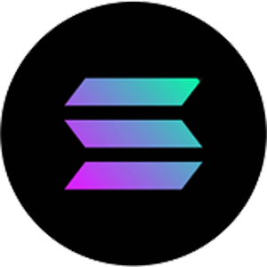
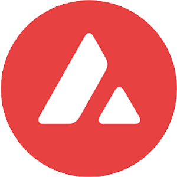

<!-- 

  

 -->

## Blockchains

<table>
  <tr>
    <td align="center" width="70">
      
       Bitcoin
    </td>
    <td align="center" width="70">
      
       Solana
    </td>
    <td align="center" width="70">
      
       Ethereum
    </td>
    <td align="center" width="70">
      
       Polygon
    </td>
    <td align="center" width="70">
      
       Binance
    </td>
    <td align="center" width="70">
      
       Avalanche
    </td>
    <td align="center" width="70">
      
       Cardano
    </td>
    <td align="center" width="70">
      
       Cronos
    </td>
    <td align="center" width="70">
      
       Near
    </td>
    <td align="center" width="70">
      
       cosmos
    </td>
  </tr>
</table>

<h2 align="left" id="macropower-tech">Favorite Tech</h2>

**> Programming languages**

    
    
    
    
    
    

**> Databases and cloud hosting**

    
    
    
    
    

**> Software and tools**

    
    
    
    
    
